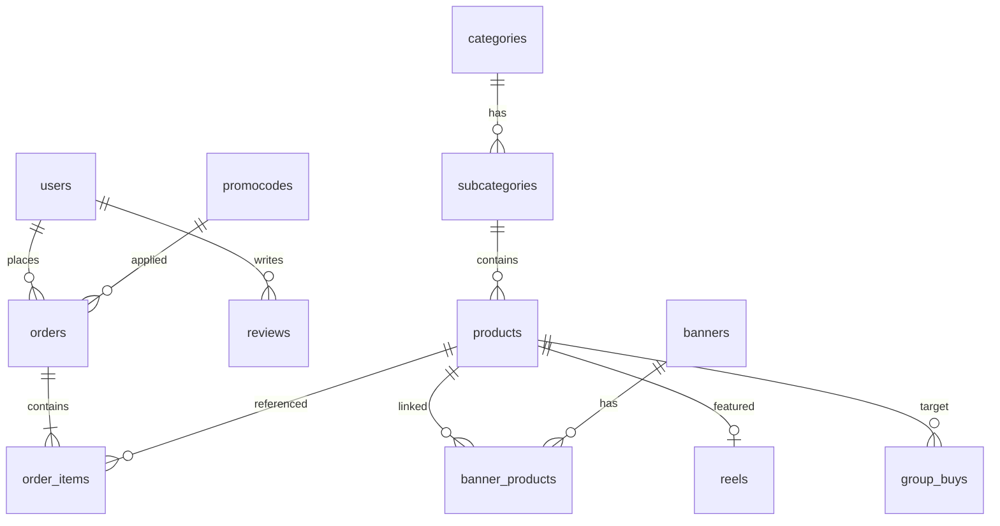

# MR-Express — Database Schema (PostgreSQL)

## ER diagram (qisqa)

---

## Asosiy jadvallar

### `users`
| Column | Type | Notes |
|--------|------|-------|
| id | UUID PK | |
| phone | VARCHAR UNIQUE | |
| full_name | VARCHAR | |
| created_at | TIMESTAMPTZ | |

### `admins`
| Column | Type | Notes |
|--------|------|-------|
| id | UUID PK | |
| email | VARCHAR UNIQUE | |
| password_hash | VARCHAR | |
| role | ENUM | superadmin, manager |

### `orders`
| Column | Type | Notes |
|--------|------|-------|
| id | UUID PK | |
| user_id | UUID FK → users | |
| status | ENUM | confirmed, processing, delivering, delivered |
| total_amount | DECIMAL | |
| promocode_id | UUID FK nullable | |
| created_at | TIMESTAMPTZ | |

### `order_items`
| Column | Type | Notes |
|--------|------|-------|
| id | UUID PK | |
| order_id | UUID FK | |
| product_id | UUID FK | |
| quantity | INT | |
| unit_price | DECIMAL | |

### `categories` / `subcategories`
| Column | Type | Notes |
|--------|------|-------|
| id | UUID PK | |
| name | VARCHAR | |
| slug | VARCHAR UNIQUE | |
| parent_id | UUID FK nullable | subcategory uchun |
| sort_order | INT | |

### `products`
| Column | Type | Notes |
|--------|------|-------|
| id | UUID PK | |
| subcategory_id | UUID FK | |
| title, description | TEXT | |
| price | DECIMAL | |
| stock | INT | |
| is_active | BOOLEAN | |

### `banners`
| Column | Type | Notes |
|--------|------|-------|
| id | UUID PK | |
| image_url | VARCHAR | |
| link_url | VARCHAR nullable | |
| is_active | BOOLEAN | |
| sort_order | INT | |

### `banner_products`
| banner_id, product_id | composite PK | |

### `discounts`
| Column | Type | Notes |
|--------|------|-------|
| id | UUID PK | |
| percent | DECIMAL | |
| valid_from, valid_to | TIMESTAMPTZ | |
| days_of_week | INT[] | 0=Sun … 6=Sat |
| product_id | UUID FK nullable | butun katalog uchun null |

### `reels`
| Column | Type | Notes |
|--------|------|-------|
| id | UUID PK | |
| video_url | VARCHAR | |
| product_id | UUID FK | |
| thumbnail_url | VARCHAR | |
| is_active | BOOLEAN | |

### `group_buys`
| Column | Type | Notes |
|--------|------|-------|
| id | UUID PK | |
| product_id | UUID FK | |
| required_participants | INT | |
| current_participants | INT default 0 | |
| deadline | TIMESTAMPTZ | |
| status | ENUM | open, completed, cancelled |

### `promocodes`
| Column | Type | Notes |
|--------|------|-------|
| id | UUID PK | |
| code | VARCHAR UNIQUE | |
| discount_percent | DECIMAL | |
| expires_at | TIMESTAMPTZ | |
| max_uses | INT | |
| used_count | INT default 0 | |

### `reviews`
| Column | Type | Notes |
|--------|------|-------|
| id | UUID PK | |
| user_id, product_id | UUID FK | |
| rating | SMALLINT 1-5 | |
| comment | TEXT | |
| status | ENUM | pending, approved, rejected |
| created_at | TIMESTAMPTZ | |

---

## Indekslar (tavsiya)

- `orders(status, created_at DESC)`
- `reviews(status)`
- `promocodes(code)`
- `products(subcategory_id, is_active)`
